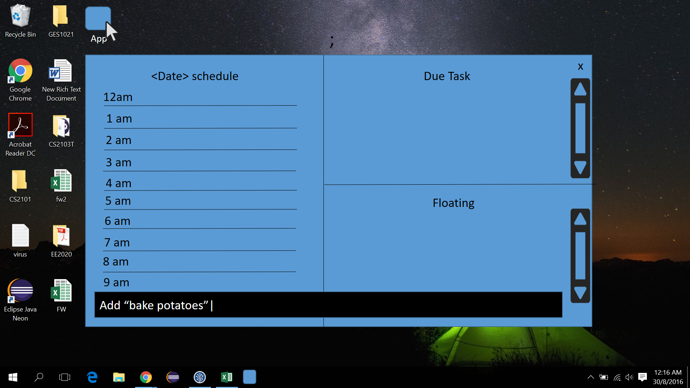
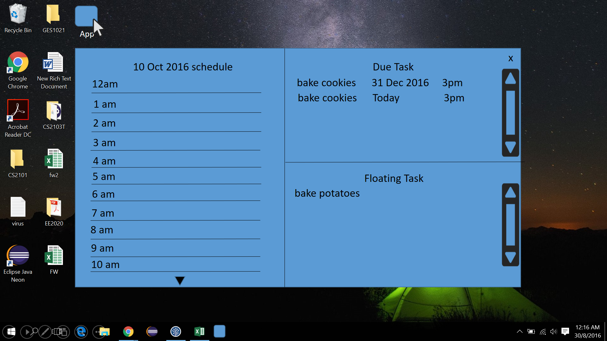
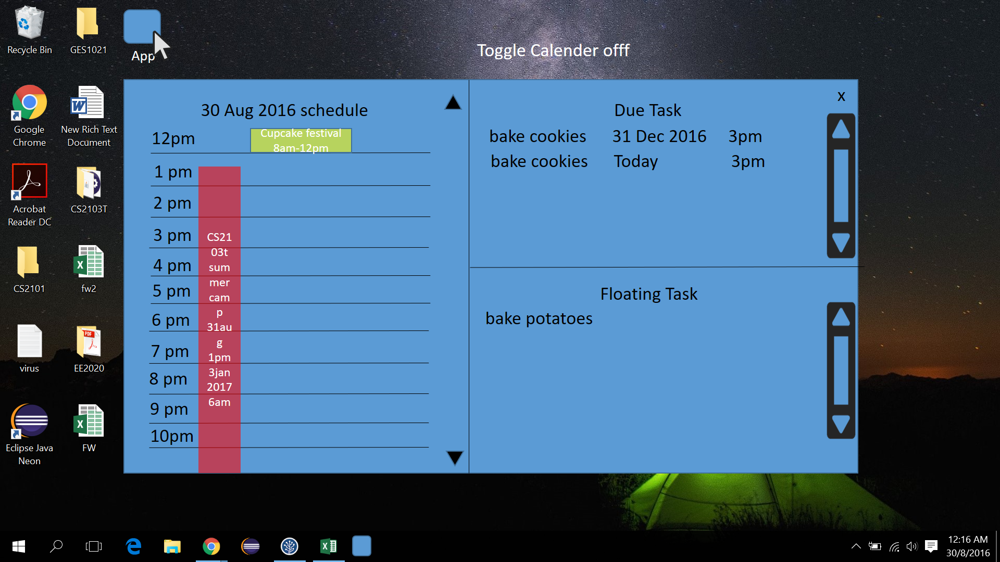
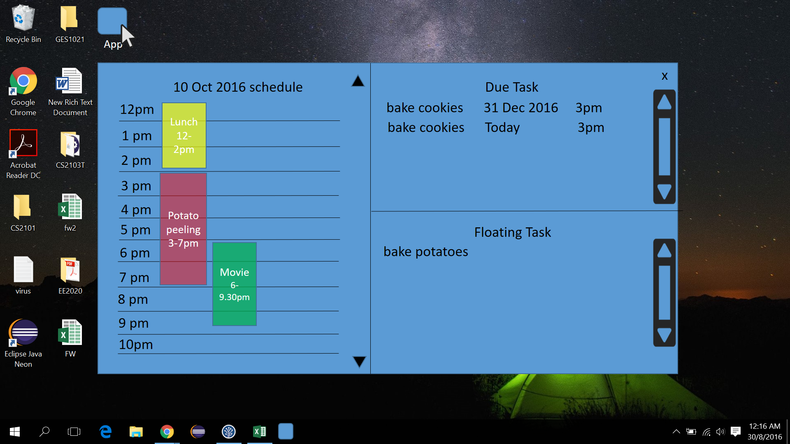
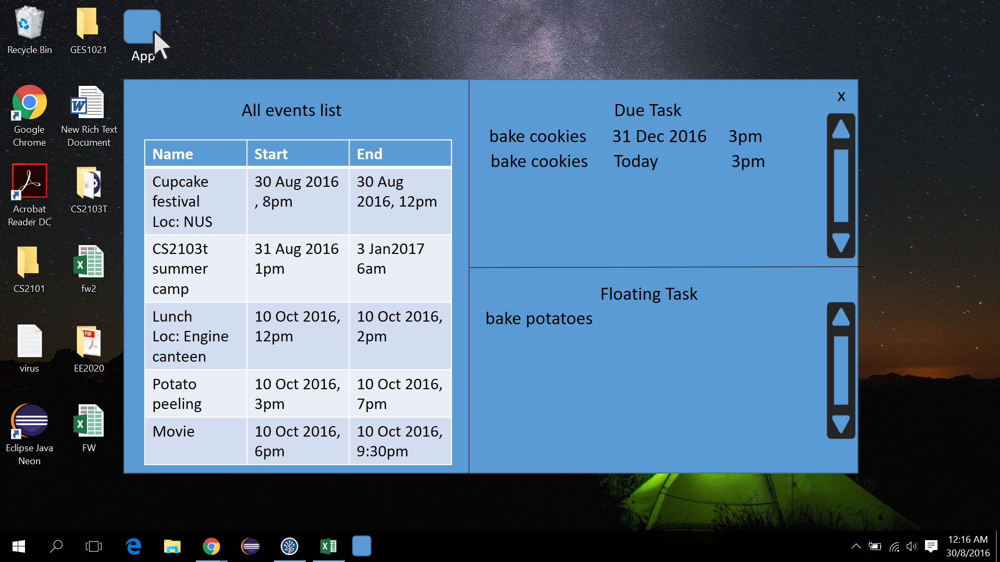
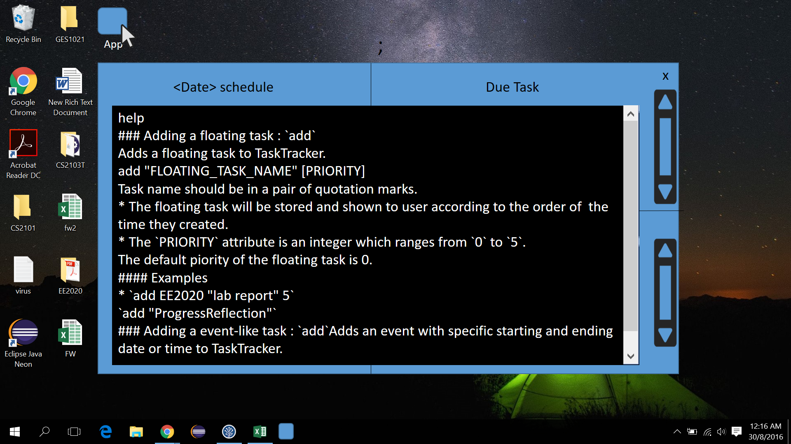

# User Guide

* [Quick Start](#quick-start)
	* [Quick Start Summary](#quick-start)
* [Features](#features)
	* [Data Models]()
    * [Command Format]()
    * [Parameter Keywords]()
    * [Date Format]()
    * [Time Format]()
    * [Viewing Help]()
    * [Add Floating Task]()
    * [Add Deadline Task]()
    * [Add Event]()
    * [list]()
    * [View Task index]()
    * [Delete]()
    * [Edit Floating Task]()
    * [Edit Deadline Task]()
    * [Edit Event]()
    * [Mark Finish]()
    * [Show Empty Timeslots]()
    * [Toggle Event views]()
    * [Search]()
    * [Undo]()
    * [Redo]()
    * [Clear]()
    * [Exit]()
* [Command Summary](#command-summary)

## Quick Start

1. Ensure you have Java version `1.8.0_60` or later installed in your computer.

  > Having any Java 8 version is not enough.
  > This app will not work with earlier versions of Java 8.

2. Download the latest `TaskTracker.jar` from the 'releases' tab.

3. Copy the file to the folder you want to use as the home folder for your task
   database.

4. Double-click the file to start the app. The GUI should appear in a few
   seconds.

5. Set up: enter your name and verify the current date and time.

6. You're good to go! Try adding your first Task. Press ';' to launch/hide the
   command bar. Press Enter to enter a command. For floating task, `add
   "taskname"`!

   

7. Add task with due date and time, example commands are:

	* `add "bake cookies" 31dec 3pm` 
      bake cookies by 31 December of this year, 3pm. Undeclared year in date field will be taken as the current year.

	* `add "bake cookies" tdy 3pm` 
      bake cookies by today, 3pm.

   

8. Add event. An event is a task with a start date and time, end date and time.  Example commands are:

	* `add "CS2103t summer camp" 30aug 1pm 3jan2017 6pm`

      Event CS2103t summer camp starts on 30 Aug 2016, 1pm, and ends on 3
      January 2017,6pm.

	* `add "potato peeling" tdy 3pm to 7pm`

      Event potato peeling starts today 3pm and ends today 7pm.

	* `add "cupcake festival" tdy 8pm tmr 12pm`

      Event cupcake festival starts on 8am and ends on 12pm of 24 Oct of this
      year.

	* `add "Trick or treat" 31oct 8pm to 9pm`

      Event Trick or treat starts today 8pm and ends on 31 Oct 9pm.

   The events for current selected day will show up under schedule.

   

9. To see the schedule of a particular day, enter `view DATE`
   The schedule for the day will show up in the schedule column.
	`view 10oct2016`
    
   
   
   To view all events, enter `view events`
   

10. To delete a task/event, try:

	    del "cupcake festival"

11. To edit a deadline, try:

	* `edit "bake potato" dd-12/10 dt-1500`

      The following properties of task are modified: due date, due time. (`dd`
      refers to `due date`, `dt` refers to `due time`)

	* `edit "bake potato" dt-3pm`

      Due time of bake potato modified.

11. To edit an event, try:

	* `edit "cupcake festival" loc-NUS`

      Location of cupcake festival set to NUS.

	* `edit "cupcake festival" st-3pm sd-12oct et-5pm ed-13oct loc-Yishun`

      All fields modified. (`st` : `starting time`, `sd` : `starting date`,
      `et` : `ending time`, `ed` : `ending date`)

    * `edit "cupcake festival" st-3pm`

      start time of cupcake festival modified.

12. To edit a floating task, try:

	* `edit "bake potato" p-1"`

      cupcake festival is given a priority of 1.

13. To exit the program, try:

	* `exit`

      Close the Task-tracker.

14. Refer to the [Features](#features) section below for details of each
    command.
    
**Quick Start Summary**

| Command | Essential Parameters|
|---------|:----------|
|add| `"taskname"`   `"deadline task name"` `date` `time`   `"event name"` `start date` `start time` `end date` `end time`|
|i| 
| edit | `floating task index` `n-` `p-`   `deadline task index` `n-` `dd-` `dt-`   `event index` `n-` `sd-` `st-` `ed-` `et` `loc-`   
| del | `index`|
| view | `date`   `events` |
| exit |
    
 

## Features

**Data models** 
The task stored in Task Tracker will be automatically grouped into three different type of task: floating task, deadline task, and event, depending on the type and number of fields entered when creating the task. 

|A/An... | has...|
|----| :--------:|:------|
|Floating Task | only a task name|
|Deadline task |  end time and date |
|Event | start time and date,  end time and date|

All the time and date fields of the task have to be entered in order to create the task.

**Command Format**

* Words in `UPPER_CASE` are the required parameters.

* Words in `lower_case` are the reserved keywords.

* Items in `[SQUARE_BRACKETS]` are optional parameters.

* Items in `<ANGLE_BRACKETS>` are essential parameters (These parameters cannot be ommitted in the command).

* Items separated by `|` are in parallel relation, only one of them should be
  use in each command.

* Items with `...` after them can have multiple instances.

* The parameters have to follow the order in which they are presented, unless otherwise specified.

**parameter keywords**

|Keyword | Definition|
|----| :--------:|:------|
|`tdy` | today|
|`tmr` | tommorow|
|`yst` | yesteday|
| `to` | to |
|`jan` | January|
|`feb` | February|
|`mar` | March|
|`apr` | April|
|`may` | May|
|`jun` | June|
|`jul` | July|
|`aug` | August|
|`sep`| September|
|`oct` | October|
|`nov` | November|
|`dec` | December|

<a name="DateFormat">**Date Format**</a>
Valid input examples:

ddmonthyy

	31dec2016

ddmonth

	31dec
* If the year is not defined, the year is assumed to be the current year. The year this document was last updated was 2016, therefore all examples protraying the current year will read 2016.

dd

	31
* If the month is not defined, the month is assumed to be the current month.

Today

	tdy

* Means today, the current date as logged by the local machine.

Tommorow

	tmr

* Means tommorow, the day after today as logged by the local machine.

To
	
    to
    
 * This keyword is only applicable for adding an event. `to` can only be entered into an `<END_DATE>` field. `to` would mean the `<END_DATE>` is the same as the `<START_DATE>` for an event. See [example](#to).

<a name="TimeFormat">**Time Format**</a>
The 12 hour clock is used. hh:mm am/pm 

Valid input examples:
	
    830am
8:30am in the morning

	1145pm
11:45pm at night

	8pm
8:00pm at night
if the minute field is 00, it may be ommitted from the command.

### Viewing help : `help`

    help

Help is also shown if you enter an incorrect command e.g. `abcd`

### Adding a floating task : `add`

Adds a floating task to TaskTracker.

    add "FLOATING_TASK_NAME" [PRIORITY] 

* Task name should be in a pair of quotation marks. And quotations marks are
not allowed in task name.

* Task name could be a single word or a phrase, white space are allowed.

* The floating task will be shown according to their `PRIORITY`.

* Two floating tasks with the same `PRIORITY` will be shown according to
  the order of the time they are created.

* The `PRIORITY` attribute is an integer which ranges from `0` to `5`, with 0 being the highest pririoty and 5 the lowest. 

* The default priority of a floating task is 0.

#### Examples

* `add "EE2020 lab report" 5`

  To create a task called `EE2020 lab report` with `PRIORITY` of 5.

* `add Progress Reflection`

  To create a task called `Progress Reflection` with default `PRIORITY` of 0.

### Adding a deadline task: `add`

Adds a deadline with specific due date and time to TaskTracker.

    add "DEADLINE_NAME" <DATE> <TIME> [PRIORITY]

* Deadline name should be in a pair of quotation marks. And quotations marks are not allowed in deadline name.

* keywords like tdy, tmr, yst, are allowed in the date field. 

* Formats of `DATE` and `TIME` should follow those stated above in this user guide. See [Date Format](#DateFormat) and  [Time Format](#TimeFormat)

#### Examples

* `add "CS2103 V1.1" 16dec 2pm`

  To create a deadline task named `CS2103 V1.1` with dateline of 16th December 2016, 2pm.
  
* `add "spend pizza vouchers" 20nov2018 2pm`
  To create a deadline task named `spend pizza vouchers` with dateline of 20 November 2018, 6pm.

* `add "event proposal" tdy 6pm`

  To create a deadline named `event proposal` with due date today, 6 pm.

* `add "EE2024 homework 1" tmr 6am`

  To create a deadline named `EE2024 homework 1` tommorow, 6 am.

### Adding a event: `add`

Adds an event with specific start date, start time and end date, end time to TaskTracker.

    add “EVENT_NAME” <STARTING_DATE> <STARTING_TIME> <ENDING_DATE> <ENDING_TIME> [loc-LOCATION]

* Event name should be within a pair of quotation marks. Quotations marks are
  not allowed in event name.

* The four parameters `<STARTING_DATE>`, `<STARTING_TIME>`, `<ENDING_DATE>`,
  `<ENDING_TIME>` are all required for adding an event.

* Formats of `<STARTING_DATE>`, `<STARTING_TIME>`, `<ENDING_DATE>`,
  `<ENDING_TIME>` should follow those stated above in this user guide.  See [Date Format](#DateFormat) and  [Time Format](#TimeFormat)

* `[LOCATION]` is a String which could contain any characters.

#### Examples

* <a name="to">`add "CS2103 week8 lecture" 7oct 2pm to 4pm`</a>

  To create an event `CS2103 week8 lecture` with starting date 7 October 2016, starting time 2pm, ending date 7 Oct 2016, ending time 4pm. 

* `add "programming workshop" tdy 10am to 5pm loc-LT15`

  To create an event `programming workshop` that starts today, 10am, and last till 5pm, at LT15.

* `add "sports training camp" 1dec2016 7pm 10jan2017 1pm`

  To create an event `sports training camp` with starting date 1 December 2016, starting time 7pm, ending date 10 January 2017 and ending time 1pm.

### List tasks: `list`

List certain type of task stored in the database

    list task|event|due

* `list task` will show all floating tasks according to the order of their priority.

* `list event` will show all events according to the order of their starting time.

* `list due` will show all deadline according to their due time and due date. (when sorting
  the deadline without due time, the sorting will use 11:59 pm of the due date as default)

* Every tasks (floating tasks / events / deadlines) will have a unique index to differentiate
  their uniqueness. And their index will also be listed besides them when `list` command is
  executed.

* The overdue/past/finished tasks will not be listed.
  
### View task index: i

UI will show the index of all floating task, deadline task and events.

	i
    
 * The index is mainly used to refer to a specific task when editing it's properties.

 * index is also used to refer to a specific task to be deleted. 

 * To switch out of index view, enter anything into the command bar.

### Deleting a floating task/event/deadline: `del`

Delete a useless floating task/event/deadline on TaskTracker.

    del TASK_UNIQUE_INDEX

* `TASK_UNIQUE_INDEX` will be different from each to each single task.

* A task's `TASK_UNIQUE_INDEX` will be the same as what is shown when `list` command is executed.
  The user can refer `list` command to look for the index of a certain task.

* `TASK_UNIQUE_INDEX` will never be changed once a index is assigned to a task when created.

#### Examples

* `i`

  List all the task stored in the database with their unique index number.

* `del 00123`

  Delete the task with the unique index of `00123`.

### Edit a floating task/deadline/event: `edit`

* Edit command can only edit the parameters of each commands but cannot change the type of task.
For example, `edit` cannot transform a floating task to a event task.

To edit an task, key in the index of the event followed by the properties to be modified. Label the new properties with their respective field references. 

#### Edit a floating task:

Edit a floating task to revise its name or priority.

|Field reference | Definition |
|:----------------:|:-----------:|
| n- | name |
| p- | priority |

    edit TASK_UNIQUE_INDEX [n-NEW_NAME | p-PRIORITY]...

* Quotation marks are not necessary for `NEW_NAME`.

* `PRIORITY` should only be the integer ranges from `0` to `5`.

#### Examples

* `edit 00124 p-0`

  Edit task with unique index of `00124`'s priority to 0.

* `edit 00124 n-buy stationary`

  Edit task with unique index of `00124`'s name to `"buy stationary"`.

* `edit 00125 n-"go to Nanyang Mart" p-1`

  Edit task with unique index of `00125`'s name to `"go to Nanyang Mart"` and priority to 1.

#### Edit a deadline :

Edit a deadline to revise its name and due date/time.

|Field reference | Definition |
|:----------------:|:-----------:|
| n- | name |
| dd- | due date |
| dt- | due time |

    edit TASK_UNIQUE_INDEX [dd-DUE_DATE | dt-DUE_TIME | n-NEW_NAME]...

* Quotation marks are not necessary for `NEW_NAME`.

* `[dd-DUE_DATE | dt-DUE_TIME]` are of the same format when creating
  event-like task. Please refer `event` command for reference.

#### Examples

* `edit 00128 dt-5pm`

  Edit deadline with unique index of `00128`'s due time to 5 pm.

* `edit 00128 dd-23/11/2016`

  Edit deadline with unique index of `00128`'s due date to 2016 23th November.

#### Edit an event :

Edit an event to revise its name, starting/ending date/time and location.

|Field reference | Definition |
|----------------|:-----------|
| n- | name |
| sd- | start date |
| st- | start time |
| ed- | end date |
| et- | end time |
| loc-| location |

    edit TASK_UNIQUE_INDEX [sd-NEW_START_TIME | st-NEW_START_DATE | ed-NEW_END_DATE | et-NEW_END_TIME | n-NEW_NAME | loc-NEW_LOCATION]...

* Quotation marks are not necessary for `NEW_NAME`.

* `[sd-NEW_START_TIME | st-NEW_START_DATE | ed-NEW_END_DATE | et-NEW_END_TIME]`
  are of the same format when creating event-like task. Please refer `event` command for reference.

#### Examples

* `edit 00126 loc-LT6`

  Edit event with unique index of `00126`'s location to `LT6`.

* `edit 00126 st-4pm et-6pm`

  Edit event with unique index of `00126`'s starting time to 4pm and ending time to 6pm.

* `edit 00127 n-"proposal meeting" st-7pm`

  Edit event with unique index of `00127`'s starting time to 7pm and name to `proposal meeting`.

### Mark a floating task/deadline as done/finished: `fin`

Mark a floating task/event/deadline as done on TaskTracker, the marked tasks
will be archived.

    fin TASK_UNIQUE_INDEX

* Events that have already passed it `DUE_TIME` will be marked as done
  automatically.

* Deadlines that have already passed it `DUE_TIME` will not be marked as done,
  but will be marked as "overdue" automatically.

#### Examples

* `fin 00123`

  Marked task `00123` as finished.

### Show empty time slots : `slot`

Show all empty time slots in a given time period with a given duration.

    slot <STARTING_DATE> <STARTING_TIME> <ENDING_DATE> <ENDING_TIME> <h-HOUR> <m-MINUTE>

* At least one of `<STARTING_DATE> <STARTING_TIME>` is required.

* At least one of `<ENDING_DATE> <ENDING_TIME>` is required.

* At least one of `<h-HOUR> <m-MINUTE>` is required.

#### Examples

* `slot 1nov2016 3nov2016 h-4`

  The TaskTracker will generate all empty time slots that are equal or greater than 4 hours
  between 2016 1st November 0am to 3rd 11:59pm.

* `slot 5nov2016 2pm 11pm m-45`

  The TaskTracker will generate all empty time slots that are equal or greater than 45 minutes
  between 2016 5st November 2pm to 3rd 11:00pm.

* `slot 5nov2016 2pm m-45`

  The TaskTracker will generate all empty time slots that are equal or greater than 45 minutes
  between 2016 5st November 0am to 2pm.

### Toggle event views: `view`

###View all the events of a specific date in TaskTracker.

    view <DATE>

* `DATE` will follow thw format shown in [Date Format](#DateFormat)

* The deadlines and events will be listed according to the order of deadlines' due time and
  events' starting time.

* The `TASK_UNIQUE_INDEX` will also be shown after `view` command is executed.

### View all events
	view events
    
* All the events in the database will be displayed in a list

#### Examples

* `view 1/12`

  View all the tasks that are of the date of 1st December of the current year.

### Search by keywords: `search`
Search task that contains specific keywords.

    search KEY_WORDS

* The `KEY_WORDS` are CASE-SENSITIVE

* Quotations marks are not allowed in `KEY_WORDS`

* The results will be listed according to their `TASK_UNIQUE_INDEX`

#### Examples

* `search lecture`

  Search for all the tasks that contain keyword `lecture`, TaskTracker will
  generate a list for view.

* `search training SESSION`

  Search for all the tasks that contain keyword `training SESSION`, TaskTracker
  will generate a list for view.

### Undo an action : `undo`

Undo the previous action that modifies data. Undo can be performed many times until the first action since the app was launched has been undone.

    undo
    
view the stack of actions that undo will perform: `undo stack`

    undo stack
    
### Redo an action : `redo`

Redo the previous action that was undone by undo. The amount of consecutive redos doable is equal to the number of consecutive undos performed right before redo is entered.

    redo
    
view the stack of actions that redo will perform: `redo stack`

    redo stack
    
### Clearing all entries : `clear`

Clears all entries from TaskTracker.

    clear

* The `TASK_UNIQUE_NUMBER` will be reset.

### Exiting the program : `exit`

Exits the program.

    exit

## Command Summary

Command | Format
------------ | :--------
Add Floating Task | `add "FLOATING_TASK_NAME" [PRIORITY]`
Add Event |`add “EVENT_NAME” <STARTING_DATE> <STARTING_TIME> <ENDING_DATE> <ENDING_TIME> [loc-LOCATION]`
Add Deadline |`add “DEADLINE_NAME” <DATE> <TIME>`
List all tasks | `list task|event|due`
Delete a task | `del TASK_UNIQUE_INDEX`
Edit Floating Tasks | `edit TASK_UNIQUE_INDEX [n-NEW_NAME | p-PRIORITY]... `
Edit Event |`edit TASK_UNIQUE_INDEX [sd-NEW_START_DATE | st-NEW_START_TIME | ed-NEW_END_DATE | et-NEW_END_TIME | n-NEW_NAME | loc-NEW_LOCATION]... `
Edit Deadline |`edit TASK_UNIQUE_INDEX [dd-DUE_DATE | dt-DUE_TIME | n-NEW_NAME]... `
Generate recommended time slots | `slot <STARTING_DATE> <STARTING_TIME> <ENDING_DATE> <ENDING_TIME> <h-HOUR> <m-MINUTE>`
Mark a task as finished | `fin TASK_UNIQUE_INDEX`
View a date in calendar | `view DATE`
Search for keywords | `search KEY_WORDS`
Help | `help`
Undo | `undo`
Redo | `redo`
Clear | `clear`
Exit | `exit`
